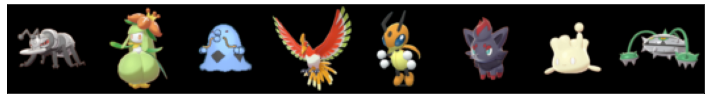
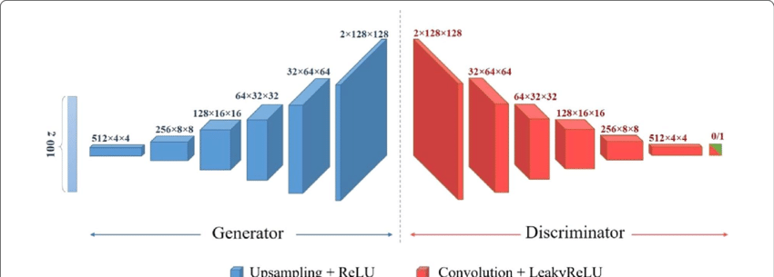
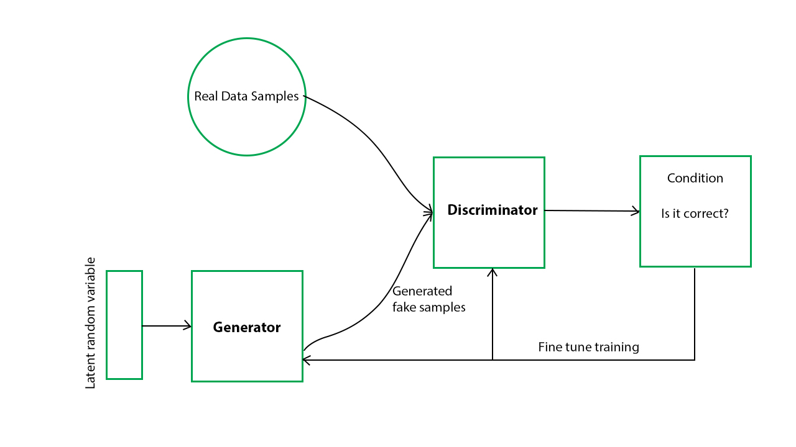
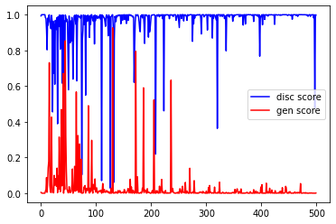
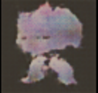

## New Pokemon Generation

As a kid I was completely obsessed with Pokemon - adorable little creatures, looking similar to our real-world animals, but having magical looks and enormous power. It was a dream of mine to somewhere in the future create a new generation of Pokemon and now it may become possible with introduction of GANs - Generative Networks that already showed great results in different generative tasks.

### Setting up an environment
PyTorch was chosen as a framework for implementing the neural network, so in order to run the code you need to have PyTorch installed. I strongly recommend using GPU version of PyTorch package alongside with NVIDIA CUDA. It highly increases training speed and makes our lives much less miserable (https://developer.nvidia.com/cuda-downloads). Also I do recommend using Anaconda for your package management:
``` 
conda install pytorch torchvision -c pytorch
```


### Preparing dataset
Dataset in use consists of sprites scraped from serebii.net. All sprites in use are official artworks from the latest Pokemon games - Pokemon Sword/Shield. There are two images for each pokemon - regular and shiny form. That makes the total dataset size to be just under 2k images. On retreived images I perform resize and normalization transformations. Also use a very convenient ImageFolder dataset class.


```python
image_size = 64
normalization_stats = (0.4819, 0.4324, 0.3845), (0.2604, 0.2520, 0.2539)
data_dir = 'PokemonSpritesSwSh'
normal_dataset = datasets.ImageFolder(data_dir, transform=transforms.Compose([
    transforms.Resize(image_size),
    transforms.CenterCrop(image_size),
    transforms.ToTensor(),
    transforms.Normalize(*normalization_stats)
]))
```

    

    


### Defining the Model
Any GAN network consists of two models: generator and discriminator. These networks involved in so-called 0-sum game and they do compete against each other. Generator's goal is to generate images that discriminator will label as images from dataset and discriminators goal is to successfully determine whether image is real or fake. Architecture in use here is actually called DCGAN (deep convolution adversarial neural network) that proves to be a good fit for problems related to images generation. 



##### Discriminator architecture
Consists of 4 stacked convolutional layers with lReLU activations (type of activations that allows a little gradient flow on the negative parameters, used instead of ReLU that completely disallow it). Also has Linear layer that combines all features extracted by convolutions and produces one number between 0 and 1 as an output (softmax activation).

```python
discriminator = nn.Sequential(
    # Input is 3 x 64 x 64
    nn.Conv2d(3, 64, kernel_size=4, stride=2, padding=1, bias=False),
    nn.BatchNorm2d(64),
    nn.LeakyReLU(0.2, inplace=True),
    # Layer Output: 64 x 32 x 32
    
    nn.Conv2d(64, 128, kernel_size=4, stride=2, padding=1, bias=False),
    nn.BatchNorm2d(128),
    nn.LeakyReLU(0.2, inplace=True),
    # Layer Output: 128 x 16 x 16
    
    nn.Conv2d(128, 128, kernel_size=4, stride=2, padding=1, bias=False),
    nn.BatchNorm2d(128),
    nn.LeakyReLU(0.2, inplace=True),
    # Layer Output: 128 x 8 x 8
    
    nn.Conv2d(128, 128, kernel_size=4, stride=2, padding=1, bias=False),
    nn.BatchNorm2d(128),
    nn.LeakyReLU(0.2, inplace=True),
    # Layer Output: 128 x 4 x 4
    
    nn.Flatten(),
    nn.Linear(128 * 4 * 4, 1),
    nn.Sigmoid()
).to(device)
```

##### Generator architecture
Consists of 5 stacked convtranspose layers (essentially the layer that is inverse to convolutional). Takes random vector of fixed size (64) in my case as an input (latent space vector). The larger the dimension of latent vector, the better and more results generator should produce.

```python
seed_size = 64
generator = nn.Sequential(
    # Input seed_size x 1 x 1
    nn.ConvTranspose2d(seed_size, 128, kernel_size=4, padding=0, stride=1, bias=False),
    nn.BatchNorm2d(128),
    nn.ReLU(True),
    # Layer output: 256 x 4 x 4
    
    nn.ConvTranspose2d(128, 128, kernel_size=4, padding=1, stride=2, bias=False),
    nn.BatchNorm2d(128),
    nn.ReLU(True),
    # Layer output: 128 x 8 x 8
    
    nn.ConvTranspose2d(128, 128, kernel_size=4, padding=1, stride=2, bias=False),
    nn.BatchNorm2d(128),
    nn.ReLU(True),
    # Layer output: 64 x 16 x 16
    
    nn.ConvTranspose2d(128, 64, kernel_size=4, padding=1, stride=2, bias=False),
    nn.BatchNorm2d(64),
    nn.ReLU(True),
    # Layer output: 32 x 32 x 32
    
    nn.ConvTranspose2d(64, 3, kernel_size=4, padding=1, stride=2, bias=False),
    nn.Tanh()
    # Output: 3 x 64 x 64
).to(device)
```

### Training the model
Discriminator and Generator are trained simultaneously. As first step generator generates a batch of images that are passed as inputs to discriminator. Discriminator trains on batch that it got from generator and also on the batch of the same size from the dataset of real pokemons. Its goal is to distinguish real data from fake one. It uses Adam optimizer and BinaryCrossEntropy loss (since we have 2-class problem). Then the BinaryCrossEntropy loss is calculated for Discriminator's results on fake data, but now "real" is the ground truth label. This loss is treated as a loss for backpropagation for generator model. In the ideal world generator and discriminator scores should balance out. This would mean that we trained a network that generates perfect new pokemon. Below is a training scheme for the network


Training the discriminator. We can predict that in this kind of problem when we have highly diverse and rather small dataset the discriminator has an advantage in the 0-sum game, so we need to make the game harder for him. For instanse, I'm adding noisy number between 0 and 0.2 for every expected output of a real dataset image (0 - real pokemon class, 1 - fake pokemon class). Also I do not propagate discriminator's loss if it did too good of a job in determining generated images.

```python
def train_discriminator(real_pokemon, disc_optimizer):
    # Reset the gradients for the optimizer
    disc_optimizer.zero_grad()
    
    # Train on the real images
    real_predictions = discriminator(real_pokemon)
    real_targets = torch.zeros(real_pokemon.size(0), 1, device=device) + 0.2
    real_loss = F.binary_cross_entropy(real_predictions, real_targets) # Can do binary loss function because it is a binary classifier
    real_score = torch.mean(real_predictions).item() # How well does the discriminator classify the real pokemon? (Higher score is better for the discriminator)
    
    # Make some latent tensors to seed the generator
    latent_batch = torch.randn(batch_size, seed_size, 1, 1, device=device)
    
    # Get some fake pokemon
    fake_pokemon = generator(latent_batch)
    
    # Train on the generator's current efforts to trick the discriminator
    gen_predictions = discriminator(fake_pokemon)
    gen_targets = torch.ones(fake_pokemon.size(0), 1, device=device)
    gen_loss = F.binary_cross_entropy(gen_predictions, gen_targets)
    gen_score = torch.mean(gen_predictions).item() # How well did the discriminator classify the fake pokemon? (Lower score is better for the discriminator)
    
    total_loss = real_loss + gen_loss
    # Update the discriminator weights
    if gen_score < 0.95:
        total_loss.backward()
        disc_optimizer.step()
    return total_loss.item(), real_score, gen_score
```

Then add a function to train generator.
```python
def train_generator(gen_optimizer):
    # Clear the generator gradients
    gen_optimizer.zero_grad()
    
    # Generating vector from a latent space
    latent_batch = torch.randn(batch_size, seed_size, 1, 1, device=device)
    fake_pokemon = generator(latent_batch)
    
    # Get descriminator's decision on generated pokemons. Generator wants to them to be 0 - real pokemon.
    disc_predictions = discriminator(fake_pokemon)
    targets = torch.zeros(fake_pokemon.size(0), 1, device=device) 
    loss = F.binary_cross_entropy(disc_predictions, targets) 

    loss.backward()
    gen_optimizer.step()
    
    # Return generator loss
    return loss.item()
```

And finally the main training loop.
```python
def train(epochs, learning_rate, disc_losses, disc_scores, gen_losses, gen_scores, start_idx=1):
    
    # <...>
    
    for epoch in range(epochs):
        for real_img, _ in tqdm(data_loader):
            real_img = real_img.to(device)
            # Train the discriminator
            disc_loss, real_score, gen_score = train_discriminator(real_img, disc_optimizer)
            # Train the generator
            gen_loss = train_generator(gen_optimizer)
```

After 500 epochs we obtain following training history:

    

    


## Results analysis
Analyzing training history above we can see that discriminator is a clear winner of 0-sum game played during training. That does mean, that unfortunately we weren't able to produce good enough outputs that can be confused with real pokemon. I think that size and diversity of dataset plays a big role in this. The dataset is really small, but still it is incredibly diverse as Pokemon resemble many different creatures from our world. But still lets see how the generated images were getting better and if there any use of them.

All outputs here are 64 images generated from fixed 64 vectors from the latent space on different epochs of model training.
***
###### Epochs 0-6
During these epochs generated images are no more than a mesh of pixels. Although, on these images you can distinctly see the squares that represents convolution filters from generator architecture. The largest squares resembles to the last convolutional layer in the model.

<p align="center">

</p>

***
###### Epochs 7-12
During these epochs we are getting heatmap-like outputs that still does not have much going on on them but they are starting to look like objects instead of just being a randomish grid of pixels. But these images are still monochromos. 
<p align="center">

</p>

***
##### Epochs 12-20
Still heatmaps, but now colorful!
<p align="center">

</p>

***
##### Epochs 21-50
Heatmaps now converted into blobs that are well separated from the background. Also colors became more vivid and it seems like that blobs are starting to get some creature-like shapes. But it's still modern art samples.
<p align="center">

</p>

***
##### Epochs 51-250
The only improvement here are the shapes. They become more pokemon-like. At least I can recognize a real pokemon reference behind a lot of these shapes. But all inner features are seem to be ignored by the model.
<p align="center">

</p>

***
##### Epochs 251-500
Now these blobs are definitely look like pokemon sprites that were drawn in watercolors and then someone spilled water on them. A lot of these examples have some inner features - distinguishable stripes and manes and even flame-like features. Although they still atrociously bad if we wanted to use them as pokemon. That said I still have some personal favourites.
<p align="center">

</p>


***
### Conclusions
Althaugh the results are not quite as what I expected starting this works it still has something to take from the experiments. For example tricks that I used for giving generators an advantage in game really helped me to get more meaningful generated images. Without that optimizations system never got past the "heatmaps" state. 

Generated images are definitely not the real pokemon, but they can definitely easily inpire one to create a real pokemon. For example this one (my personal fauvorite).

<p align="center">

</p>

It has it's clear identity of being some kind of calm and sleepy spirit with big head and a mantle that adds him some royalty features. If one do some tydiing up in the artstyle and add sharper edges it would be a great addition to Pokemon roster.

Points of improvement the model:
- mine bigger dataset (maybe include sprites from earlier games and official arts)
- train more epochs (I had no patience to wait a few days, bad me...)
- come up with a model that can produce a sharp sprite from an "watercolors" version of it